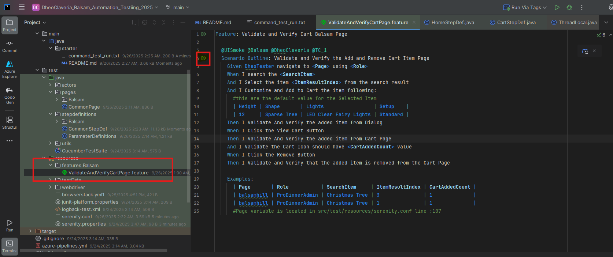

Dheo Claveria - Technical Exam - Test Automation Testing

Programming Language       : Java
Automation Tools           : Selenium WebDriver, Serenity BDD, Cucumber
IDE                        : IntelliJ (community edition)
Website Application tested : https://www.balsamhill.com/

========================================================================================================

You can test it locally using the following steps:

1. Install IntellJ community edition              : https://www.jetbrains.com/idea/download/#section=windows
2. Open command and clone the repo                : git clone https://github.com/dheybenclave/DheoClaveria_Balsam_Automation_Testiing_2025.git
3. Open the IntellJ and Open the Project as Maven
4. Make sure you install the java JDK 21 or 11 LTS on your local machine and set in the enviroment variables :
5. You can test via IntellJ config using the cmmnd >

              * mvn clean verify -D"cucumber.filter.tags=@TC_1" //Run specific scripts tags
              * mvn clean verify -D"cucumber.filter.tags=@TC_1" -Denvironment=chrome //Run specific scripts tags -env = chrome,edge,firefox

6. Or Using IntellJ :
   Go to src/test/resources/features/grid/gridtesting.feature and you will the green triangle(start) button and click for specific run
   
7. Or using the Run.xml for global testing using tags: click the edit config > update the tags in Program Arguments > Save > run
   
 
**Automation Code Assessment Instructions**

**Objective**
    The goal of this assessment is to evaluate the candidate’s ability to create a functional test
    automation framework from scratch, following best practices and using either Selenium or
    Playwright. The test case to be automated is detailed below.

**Test Scenario**
- Go to https://www.balsamhill.com/
  - Search for 'Christmas Tree' using the search bar.
  - Select the third result that appears on the results page.
  - On the product selection page, choose any available customization options.
  - Click Add to Cart.
  - Click View Cart.
  - Validate that the price displayed on the results page is the same on the product page and
    the cart page.
  - Validate that the Cart icon shows the number 1, indicating an item has been added.
  - Click the trash can icon to remove the item from the cart.
  - Validate the removal confirmation dialog that states '<Item> has been removed'.
  - Close the webpage.
    Project Requirements
    The candidate must implement the test using the Page Object Model (POM) design pattern
    and adhere to best coding practices. The project should be uploaded to a public GitHub
    repository and must include a README file with instructions on how to set up and execute
    the test suite.
    Framework Setup Requirements
  - Use Selenium (Java, JavaScript, or TypeScript) or Playwright (JavaScript or TypeScript).
  - Utilize a test runner (JUnit/TestNG for Java, Jest/Mocha for JS/TS).
  - Implement the Page Object Model (POM) for maintainability.
  - Use a package manager (Maven/Gradle for Java, NPM for JS/TS).
  - Include reusable utilities for handling web elements, assertions, and waits.
  - Implement proper logging (e.g., Log4j, console logs).
  - Ensure clear test reporting using ExtentReports, Allure, or a built-in test reporter.
  - Use Git for version control, and commit the project to a public GitHub repository.
    Submission Instructions
  - Ensure all tests pass successfully.
  - Create a public GitHub repository and push your project.
  - Include a README.md file with the following details:
- - Project description
- - Framework setup and dependencies
- - Instructions to clone and execute the tests
- - Expected test outputs
  - Share the GitHub repository link with us.
    Bonus (Optional)
  - Implement data-driven testing (e.g., reading test data from an external file).
  - Use environment-based configuration (e.g., .env file, config properties).
  - Add cross-browser testing support.
    Evaluation Criteria
  - Code Structure & Organization: Use of POM, modularity, and reusability.
  - Automation Reliability: Proper waits, error handling, and execution stability.
  - Readability & Maintainability: Clean and structured code.
  - Correctness of Test Validations: Ensure all validation steps are covered.
  - Successful Execution: The test runs successfully without failures.